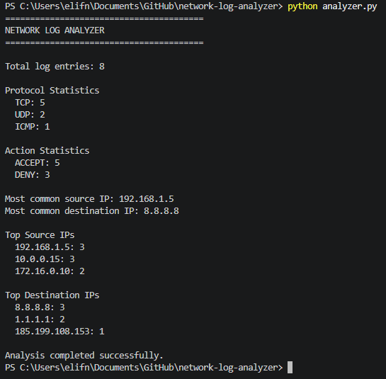

# Network Log Analyzer

A Python-based network log analyzer developed as a cybersecurity portfolio project.

The application reads network log files, analyzes network traffic statistics, detects suspicious activity, and generates a report.

---

## Features

- Analyze network log files
- Count total log entries
- Display protocol statistics (TCP, UDP, ICMP)
- Display ACCEPT / DENY statistics
- Find the most common source and destination IPs
- Display the Top 3 source and destination IPs
- Detect suspicious activity (multiple denied connections)
- Skip invalid log entries safely
- Generate an analysis report (`reports/report.txt`)
- Support custom log files from the command line

---

## Project Structure

```
network-log-analyzer/
│
├── logs/
│   └── sample.log
│
├── reports/
│   └── report.txt
│
├── images/
│   └── output.png
│
├── main.py
├── parser.py
├── analyzer.py
├── report.py
├── README.md
├── requirements.txt
└── .gitignore
```

---

## Sample Log Format

```text
192.168.1.5 -> 8.8.8.8 TCP 80 ACCEPT
```

---

## Example Output

```text
========================================
NETWORK LOG ANALYZER
========================================

Total log entries: 8

Protocol Statistics
  TCP: 5
  UDP: 2
  ICMP: 1

Action Statistics
  ACCEPT: 5
  DENY: 3

Suspicious Activity
WARNING: 10.0.0.15 has 3 denied connections.
```

---

## Screenshot



---

## Technologies

- Python 3
- collections.Counter
- Git
- GitHub

---

## How to Run

Clone the repository

```bash
git clone https://github.com/elifnurtomaz/network-log-analyzer.git
```

Go to the project directory

```bash
cd network-log-analyzer
```

Run the application

```bash
python main.py
```

Or analyze another log file

```bash
python main.py logs/sample.log
```

---

## Future Improvements

- Export reports as CSV
- JSON log support
- Interactive charts
- Unit tests
- IPv6 support
- Web dashboard

---

## License

This project is developed for educational and portfolio purposes.